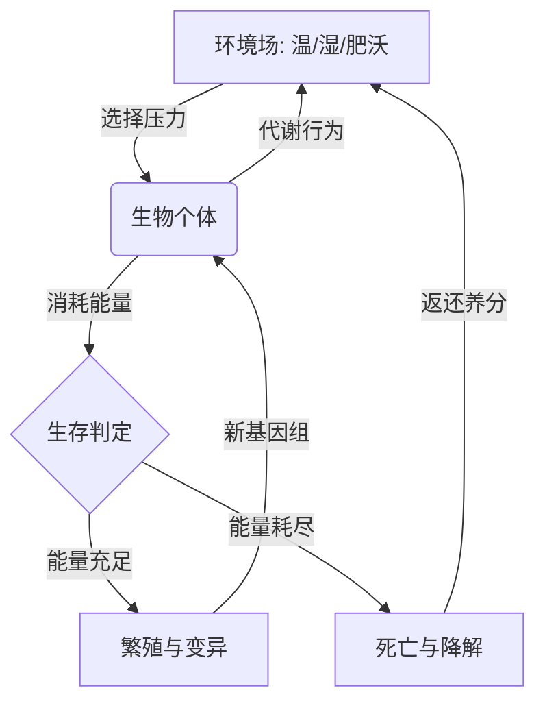

# 生态进化系统详细设计方案 (Detailed Ecology & Evolution Spec)

本文档旨在详述 Colony 的核心引擎——“涌现式进化系统”的逻辑闭环，确保在实现过程中不偏离“由底层规则驱动演化”的目标。

---

## 1. 模拟核心逻辑循环 (The Meta-Loop)

模拟的核心是一个基于**能量平衡**的闭环。

---

## 2. 基因组与表现型 (Genome & Phenotype)

生物不再按类定义，而是由 `Genome` (一组 0.0 - 1.0 的浮点数) 驱动：

### A. 物理性状基因 (Physical Genes)
- **Size (体型)**: 影响视觉缩放、最大生命值上限、基础代谢消耗速率（正相关）。
- **Speed (速率)**: 影响移动系统的速度，同时也增加移动时的能量损耗。
- **SensoryRange (感知范围)**: 决定寻路系统能搜索资源的探测半径。

### B. 代谢策略基因 (Metabolic Genes)
- **DietType (食性)**: 0.0(完全光合) -> 0.5(杂食) -> 1.0(完全肉食)。
- **Efficiency (代谢效率)**: 将摄入资源转化为内部能量的比例。

### C. 行为倾向基因 (Behavioral Genes)
- **Aggression (攻击性)**: 决定在遇到其他生物时触发“攻击”而非“逃跑”的概率。
- **Sociality (社交度)**: 决定是否倾向于向同类坐标靠近（形成集群）。

---

## 3. 能量经济学 (Energy Economy)

这是过滤劣等基因的“金标准”。

### 能量消耗 (Entropy)
所有实体在每秒（Tick）都会损失能量：
`Cost = BaseMetabolism(Size) + ActionCost(Moving/Attacking)`

### 能量获取
1. **生产者 (Photosynthesis)**: 如果所在磁贴有光照且 `DietType` 偏向光合，则直接从环境获取能量，消耗磁贴的 `Fertility`。
2. **消费者 (Predation/Foraging)**: 通过任务系统吃掉其他实体，转移对方的能量。

---

## 4. 环境场：物理环境的选择器 (Abiotic Framework)

世界由三个动态属性场组成：

1. **温度场 (Temperature Field)**:
    - 逻辑：高海拔低温，地下恒温。受随机“气候事件”波动。
    - 影响：若个体 `Genome` 的 `ThermalComfort` 与环境偏离过大，将大幅增加能量消耗速率（热应激/寒冷应激）。
2. **湿度场 (Humidity Field)**:
    - 逻辑：靠近水源磁贴高。
    - 影响：决定植物（生产者）的能量转化上限。
3. **肥沃度场 (Fertility Field)**:
    - 逻辑：磁贴的基础养分计数值。
    - 状态：生物进食会抽干它，生物死亡腐烂会瞬间充盈它。

---

## 5. 繁殖、变异与演化 (Evolutionary Mechanics)

### 繁殖与生殖隔离 (Reproductive Isolation)
- **生殖准入**: 当两个实体尝试交配时，计算其基因向量距离 $D = |G_1 - G_2|$。
- **动态隔离**: 仅当 $D < D_{threshold}$ 时允许产生后代。这模拟了自然界的物种形成：地理隔阂导致基因渐变，最终形成物理上的生殖隔离。
- **变异逻辑**: 后代 $Genome = Parent\_Genome + RandomOffset(-MutationRate, +MutationRate)$。

---

## 7. 智能层次与行为演变 (Intelligence & Behavior)

我们将智能视为一种**策略投资**。高认知能力意味着更复杂的生存策略，但也伴随着巨大的基础代谢能量损耗。

### 认知模型分级 (Cognitive Tiers)
1. **反应级 (Reactive - 低智能)**: 
    - 实现：简单的状态机 (Simple FSM)。
    - 行为：仅根据当前位置的属性（光照、食物感应）直接决定下一位移。
2. **记忆级 (Memory-Based - 中等智能)**:
    - 实现：带权重的地图感知图。
    - 行为：能记住水源、危险区域的位置。
3. **抽象级 (Abstract/Cultural - 高智能)**:
    - 实现：**模式识别与非遗产信息传递**。
    - 行为：能够理解“物料组合”逻辑（文明的起点）。

---

## 8. 工具雏形与涌现式科技 (Emergent Technology)

我们不使用预定义的科技树，而是采用“属性交互系统”。

### 工具的诞生 (Tool Discovery)
- **物质属性 (Affordances)**: 环境中的资源（石头、木棍）具有底层属性（硬度、锐度、延展性）。
- **摆弄逻辑 (Tinkering)**: 具备“抽象级智能”的个体在闲暇或极端需求驱动下，会尝试组合邻近物品。
- **配方发现**: 如果 (硬物 + 韧物) 的组合产生了一个具备 `Chopping Efficiency > 1.0` 的新实体，该个体建立一个“心理配方 (Mental Recipe)”。

### 工具的使用与传承
- **工具加成**: 当个体携带特定物品执行任务（如 `Chop`）时，其效率受工具属性增益。
- **社会学习 (Social Learning)**: 高智能个体通过观察邻居的行为，有概率直接将对方的“心理配方”拷贝到自己的大脑中。

---

## 9. 动植物的连续光谱 (Mobility Spectrum)

不再区分固定的动物/植物类，通过基因控制表现：
- **`Mobility` 基因**: 0.0 表示固着生长，能量消耗极低；1.0 表示高速奔跑。
- **`Metabolism` 基因**: 基础代谢的代价。

---

## 10. 系统架构优化：从“类型”转向“属性” (Data-Driven Architecture)

为了支持涌现属性，系统必须从硬编码的枚举（Enumerations）转向基于属性（Attributes）的定义。

### A. 磁贴容器化 (Tile as Container)
- **不再是简单的 `TileType`**: 磁贴变为一个包含视觉引用、物理状态和环境数据的容器。
- **环境场接入**: 磁贴直接响应 `EnvironmentalData`（温度、湿度、肥沃度、光照）。

### B. 资源属性化 (Property-based Resources)
- **物质属性 (`MaterialProperties`)**: 所有物品（木、石、肉）均具备底层参数：
    - `Mass` (质量): 影响携带代价。
    - `Hardness` (硬度): 决定作为工具的破坏力和作为食物的消化难度。
    - `EnergyDensity` (能量密度): 决定其作为燃料或食物的价值。

---

## 11. 模拟精细度：三层 Tick 架构 (Simulation Precision)

在 Bevy ECS 中通过调度控制不同频率的模拟，以平衡深度与性能：

1.  **物理/动力层 (60 FPS)**:
    - 负责：平滑视觉位移、粒子效果、即时碰撞。
2.  **生物/代谢层 (2-4 FPS)**:
    - 负责：基因驱动的能量损耗逻辑、AI 决策路径规划、捕食判定。
    - *特点*：慢速 Tick 支撑大规模集群演化。
3.  **环境/演化层 (极低频/事件驱动)**:
    - 负责：环境场（热量、水分）扩散、资源再生、全局生殖隔离聚类。

---

## 12. 系统三位一体：环境、资源与生物 (The Nexus)

- **环境 (Environment - 背景场)**: 空间的物理上下文，提供**选择压力**与**初级能源**。
- **资源 (Resource - 中介物)**: 物质的可测量状态，具备具体的物理属性，是能量与信息的载体。
- **生物 (Organism - 转换器)**: 系统的主动代理，根据基因组（Genome）定义的策略，在环境压力下提取资源能量，并转化环境属性。

---

## 13. 系统实现分层路线图 (最新版)

### 第一阶段：能量、基因与代谢
- 实现 `Genome` 核心，包含 `Mobility` 和 `Metabolism` 参数。
- 打通能量损耗与生存判定的闭环。

### 第二阶段：认知与行为接口
- 为 `Brain` 引入分级 AI 评估器。
- 低智能使用现有的 `ThinkingSystem`，高智能启用 `AbstractSolver` 槽位。

### 第三阶段：物质交互与配方
- 引入物品的底层属性系统（硬度等）。
- 实现简单的“组合演化”逻辑。

### 第四阶段：社会学习与族群监测
- 实现生殖隔离判定逻辑。
- 开发可视化工具：热图显示“知识（配方）”在地图上的传播路径。

